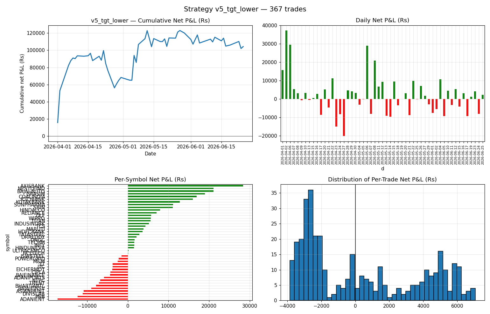
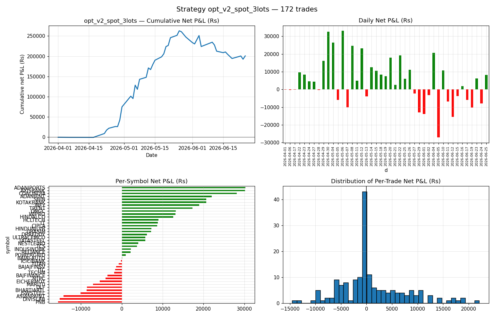

# OI-Momentum Intraday Strategy (Dhan API)

Intraday momentum strategy that uses **real-time Open Interest** changes on
NSE stock futures, combined with price and volume confirmation, to identify
stocks gaining momentum and trade the front-month future intraday.

Built and backtested end-to-end against the [Dhan HQ v2 REST API](https://dhanhq.co/docs/v2/).

Two execution vehicles tested for the **same OI-momentum signal**:

| Vehicle | Net P&L (after Dhan brokerage + STT + statutory) | Sharpe | Report |
|---|---|---|---|
| Stock **Futures** (1 lot) | **₹ 1,04,324** | 2.93 | [`REPORT.md`](REPORT.md) |
| **ATM Stock Options** (3 lots, buy CE/PE) | **₹ 2,00,877** | **5.66** | [`REPORT_OPTIONS.md`](REPORT_OPTIONS.md) |

over 58 trading days. See the linked reports for full strategy specs,
iteration logs, cost models and caveats.

## Quick start

```powershell
# 1. Create .env with your Dhan credentials
copy .env.example .env
# edit .env and put in your DHAN_ACCESS_TOKEN

# 2. Install deps
pip install requests pandas numpy python-dotenv tqdm pyarrow matplotlib

# 3. Build the universe and fetch ~3 months of 5-min data (≈ 1 min, ~90 API calls)
python src/universe.py
python src/fetch_data.py

# 4. Run the final strategy + chart
python src/strategy.py --tag final --price_pct 0.0025 --oi_pct 0.003 \
    --vol_z 2.0 --sl_pct 0.004 --tgt_pct 0.008
python src/charts.py final
```

## Layout

| Path | Purpose |
|---|---|
| `src/dhan_client.py` | Thin rate-limited Dhan v2 REST client (uses `.env`) |
| `src/universe.py` | Downloads instrument master, picks 43 liquid F&O stocks |
| `src/fetch_data.py` | Pulls 5-min OHLCV (+ OI on futures) into `data/raw/*.parquet` |
| `src/costs.py` | Dhan equity-MIS and futures-MIS cost models |
| `src/option_costs.py` | Dhan F&O **options** intraday cost model |
| `src/strategy.py` | Signal generation, event-driven backtester (futures/equity), `Params` dataclass |
| `src/strategy_options.py` | ATM-options backtester (same signal, options vehicle) |
| `src/charts.py` | Equity curve, daily PnL, per-symbol PnL, trade-PnL distribution |
| `src/run_v7.py` | Helper that re-runs the final-iteration futures variants |
| `src/run_options_sweep.py` | Sweep of options variants (spot/premium stops, 1/3 lots) |
| `REPORT.md` | Full futures strategy spec, iteration log, cost model, caveats |
| `REPORT_OPTIONS.md` | Options vehicle backtest + futures-vs-options head-to-head |
| `results/` | Backtest outputs for all 30+ futures + 7 options variants |
| `data/universe.csv` | Symbol → (spot_security_id, fut_security_id, lot_size) |
| `data/raw/*.parquet` | Cached 5-min OHLCV+OI (futures + spot) |
| `data/opt/*.parquet` | Cached 5-min OHLCV for ~1500 option contracts |

## Headline results — Futures vehicle (`v5_tgt_lower`)

| Metric | Value |
|---|---|
| Period | 1-Apr-2026 → 25-Jun-2026 (58 trading days) |
| Trades | 367 (200 long / 167 short) — 6.9/day across 43 stocks |
| Win rate | 43.6% |
| Avg net P&L / trade | ₹284 |
| Gross P&L | ₹1,67,083 |
| **Total brokerage + taxes** | ₹62,760 (37.6% of gross) |
| **Net P&L** | **₹1,04,324** |
| Sharpe (daily, annualised) | **2.93** |
| Max drawdown | ₹–43,438 |



## Headline results — ATM Options vehicle (`opt_v2_spot_3lots`)

Same signal, but each entry buys 3 lots of the front-month ATM Call (long) or Put (short):

| Metric | Value |
|---|---|
| Trades | 172 (98 CE / 74 PE) — 4.0/day across 43 stocks |
| Win rate | 42.4% |
| Avg net P&L / trade | ₹1,168 |
| Reward : risk (realised) | 2.31 : 1 |
| Gross P&L | ₹2,27,910 |
| **Total brokerage + taxes** | ₹27,033 (11.9% of gross) |
| **Net P&L** | **₹2,00,877** |
| Sharpe (daily, annualised) | **5.66** |
| Max drawdown | ₹–70,190 |



## Strategy logic in one paragraph

On every closed 5-min **futures** bar:
- **Long buildup** = Δprice ≥ +0.25% **and** ΔOI ≥ +0.30% **and** volume z-score ≥ 2.0 → buy 1 lot of front-month future at next bar open.
- **Short buildup** = Δprice ≤ –0.25% **and** ΔOI ≥ +0.30% **and** volume z-score ≥ 2.0 → short 1 lot.
- Filters: trade window 09:45–14:30 IST, skip 12:00–13:00 lunch, spot price must agree with day-VWAP trend.
- Exits: 0.4% SL / 0.8% TGT (2:1 R:R), OI-flip exit if positions start unwinding, mandatory square-off at 15:15.

See [`REPORT.md`](REPORT.md) for full iteration history (30+ variants tested,
v1 → v7), cost-model details, per-symbol attribution, and honest data caveats.

## Notes
- The historical Dhan API only exposes active F&O contracts, which caps the
  futures-OI backtest at ~3 months (the lifetime of the current front-month
  contract). Equity spot data is available 5+ years.
- Backtest assumes worst-case fill (SL before TGT in straddling bars).
  Production should budget 1–2 ticks of slippage on top.
